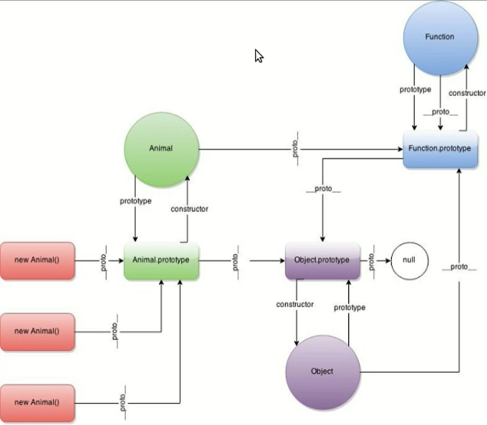
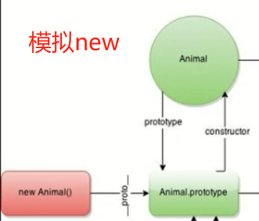

内容：

* JS原型链
* 使用函数模拟一个new运算符 （面试常考）
* 使用prototype模拟继承（面试常考）

----

### JS 原型链

记住：

* 1.只有函数才有prototype(也有`__proto__`)，实例（new Animal())只有`__proto__`
* 2.函数是Function的实例，函数的prototype是Object的实例
* 3.`Function.__proto__`和`Function.prototype`相等（比较特殊的地方）
* 4.`Object.prototype.__proto__`指向null

##### 继承系统

解读：

1. 实例的`__proto__` 等于 `Animal.prototype`
2.  `Animal.prototype.constructor`指向Animal自身，`Object.prototype.constructor`也指向自身`Function.prototype.constructor`也指向自身，所有函数都具有这样的特性
3. Animal是个函数，只要用`function`声明了它，就自动会带上prototype属性。Animal是一个`Function`类的实例，instanceof Function 为 true。`Animal.__proto__`等于`Function.prototype`
4. `Animal.prototype`是Animal上的一个属性，他是一个Object对象，instanceof Object 是true。`Animal.prototype.__proto__` 等于 `Object.prototype`

原型链的具体概念：

​    如果在这里实现一个aaa ，找方法首先是从`Animal.prototype`里找方法，如果找不到的话就去`Object.prototype`里面去找，如果还找不到就到null了就会抛出错误。

### 模拟new

结合上面图示，发现 `new`做的事情是：

1. 声明一个对象
2. 把`object.__proto__`和`Animal.prototype`挂在一起
3. 在obj上调用Animal函数
4. 返回对obj

做这个过程

----

### 使用prototype模拟继承

模拟继承做了这个过程:

